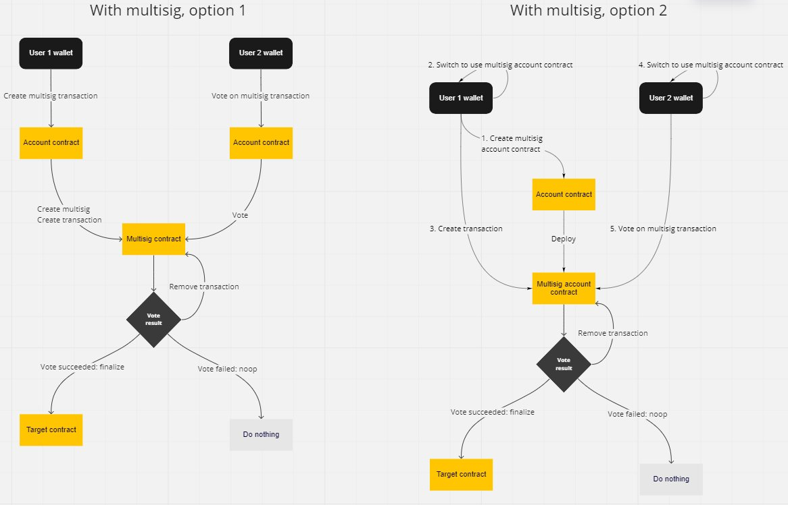

# Starsign multisig

Multi-signature functionality for [StarkNet](https://starknet.io/what-is-starknet) utilizing Cairo 1.

> ## ⚠️ WARNING! ⚠️
>
> This project is under construction.
> **Do not use in production.**

## Current version

The current version contains all basic multisig functionality, written in Cairo 1. This version consists of two pieces:

- Cairo contract code
- Unit tests for testing all the multisig functionality

The current version supports on-chain multi-signatures. The multisig is a separate contract, which is called through your regular account contract (wallet).

The current version is not finalized and is lacking some unit tests. As the Cairo 1 compiler evolves, the contract syntax and language capabilities also evolve - this repo will be updated to reflect the new functionalities.

## Audit

This code has not been audited yet.

## Functionality

The following functionality is supported:

- Create a new multisig contract with the following parameters:
  - List of signer addresses
  - Multisig threshold
- Submit a transaction
- Confirm a transaction
- Execute a transaction
- Revoke a transaction confirmation
- Change the list of signers and threshold

### Creating a new transaction

When creating a new transaction, you should call the `submit_transaction` function with the following parameters:

- `to`: Address of the transaction target
- `function_selector`: Name of the target function, decoded as an integer (felt)
- `function_calldata`: The custom parameters to pass to the target function
- `nonce`: Transaction nonce. Has to be +1 compared to the previous submitted transaction

Only signers of the multisig can submit a transaction.

### Confirming a transaction

Once a transaction has been submitted to the multisig, it needs to be confirmed by `threshold` amount of signers. To confirm a transaction as a signer, you should call the `confirm_transaction` function with the transaction `nonce` as parameter.

Only signers of the multisig can confirm a transaction.

### Executing a transaction

Once a transaction has been confirmed by `threshold` amount of signers, it can be executed by anyone - the executer does not have to be a signer. The execution is done by calling the `execute_transaction` function with the transaction `nonce` as parameter.

### Revoking a confirmation

If you, as a signer, have confirmed a transaction, but wish to revoke the confirmation, you can call the `revoke_confirmation` function with the transaction `nonce` as parameter.

### Changing the signers and threshold

There exist three functions for changing the signers and threshold:

- `set_threshold`
- `set_signers`
- `set_signers_and_threshold`

Only signers can change the threshold and the amount of signers. These actions need to go through the multisig itself, so you have to go through the `submit_transaction` function (setting the multisig contract itself as the transaction target).

## UI

The UI for the contracts is being developed in its own [repo](https://github.com/eqlabs/starknet-multisig-ui).

## Future development

In near future we'll get here:

- Possibly an option to use an account contract as multisig
- Possibly off-chain signatures

### Multisig implementation options

The current implementation uses Option 1 in the following image. Option 2 is in our roadmap for near future.

## Used technologies

- Scarb for package management
- Cairo 1 compiler

## Usage

- Install [Scarb](https://docs.swmansion.com/scarb)
- If needed, install [Cairo 1.0](https://github.com/auditless/cairo-template) separately
- Compile: `scarb build`
- Run tests: `scarb run test`

## Fluffy stuff

Created by [Equilibrium](https://equilibrium.co).

If you have any question, feel free to [join our Discord](https://discord.gg/BZbrRbSd2f).
